## Justificación 

## DOCKER-COMPOSE.YML
- Se agregaron 2 bases de datos independientes para implementar el patrón **Database-per-Service**
- Se agregaron 2 microservicios nuevos: `catalog-service` (gRPC server) y `order-service` (gRPC client)
- Se montó el volumen `/proto` compartido para que ambos servicios lean el mismo contrato gRPC

## catalog.proto
- Define el contrato de comunicación gRPC entre order-service (cliente) y catalog-service (servidor)
- Especifica tipos de datos precisos (int32, double, bool, string, repeated)
- Sigue el estándar Protocol Buffers para comunicación eficiente

## CATALOG-SERVICE (Servidor gRPC)
- Implementa el servidor gRPC que recibe peticiones de validación
- Usa @GrpcMethod para exponer el método definido en el proto
- Mapea los campos de camelCase a snake_case para compatibilidad

## catalog.service.ts:
- Valida 4 criterios: existencia, pertenencia al restaurante, disponibilidad, precio correcto
- Retorna todos los errores encontrados en un solo array para mejor UX
- Usa la base de datos delivereats_catalog para consultar productos

 ## ORDER-SERVICE (Cliente gRPC)
- Crea el cliente gRPC que se conecta a catalog-service:50052
- Carga el proto dinámicamente desde el volumen compartido
- Implementa ValidateProducts como método asíncrono que retorna una Promise

## ENTIDADES

- Representa el catálogo de productos de cada restaurante
- El campo disponible permite validar disponibilidad en tiempo real
- Usa @Column({ name: 'restaurant_id' }) para mapear snake_case a camelCase


### Carga en DB 
En esta captura se muestra que se cargaron los datos correctos en la base de datos, haciendo los inserts en la tabla productos 

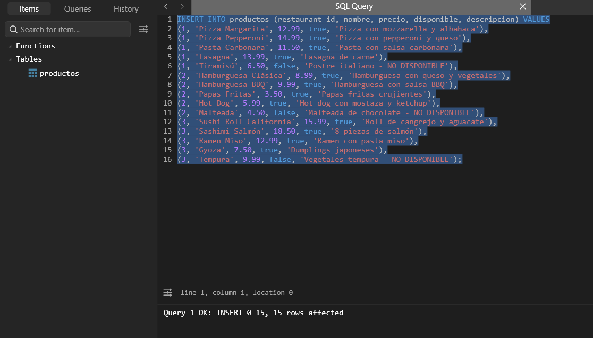

Productos cargados 
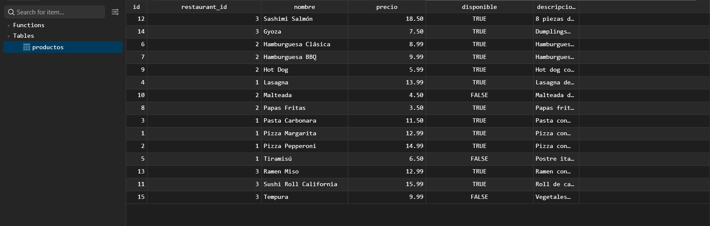
---
# PRUEBAS EXITOSAS

## Prueba 1
### ORDEN SIMPLE 
Aca se demuestra que se cargo el producto correctamente por ente la Orden fue valida, se estan ordenando dos productos de Q12.99 y muestra su estado CONFIRMADA y su total: Q.25.98.

```json
  curl -X POST http://localhost:3001/api/orders \
  -H "Content-Type: application/json" \
  -d '{
    "restaurantId": 1,
    "userId": 1,
    "productos": [
      {
        "product_id": 1,
        "expected_price": 12.99,
        "quantity": 2
      }
    ]
  }'

```
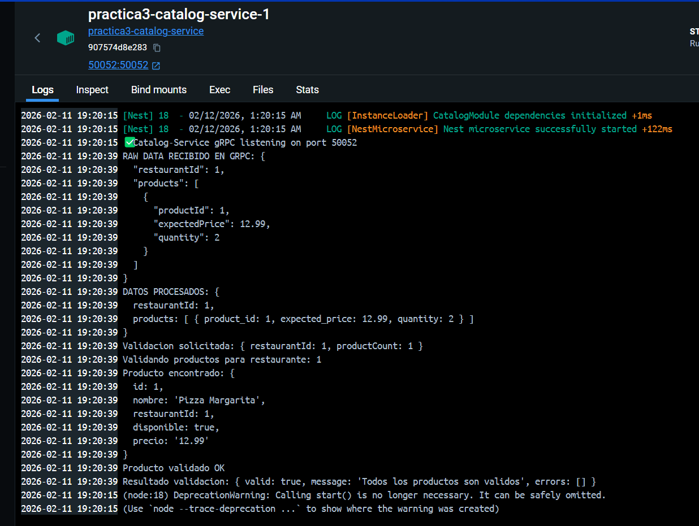

```json
  {"ok":true,
  "message":"Orden creada exitosamente",
  "order":{"restaurantId":1,"userId":1,"productos":[{"product_id":1,"expected_price":12.99,"quantity":2}]
  ,"total":25.98,
  "estado":"CONFIRMADA","id":1,"createdAt":"2026-02-12T01:20:39.399Z"}
  }
```

## Prueba 2
### PRODUCTOS MULTIPLES 
En esta prueba se seleccionan diferentes o multiples ordenes del mismo restaurante.

Esperado: Total = 49.98, Estado = CONFIRMADA

```json
curl -X POST http://localhost:3001/api/orders \
  -H "Content-Type: application/json" \
  -d '{
    "restaurantId": 1,
    "userId": 2,
    "productos": [
      {
        "product_id": 1,
        "expected_price": 12.99,
        "quantity": 1
      },
      {
        "product_id": 3,
        "expected_price": 11.50,
        "quantity": 2
      },
      {
        "product_id": 4,
        "expected_price": 13.99,
        "quantity": 1
      }
    ]
  }'
```
Curl en consola
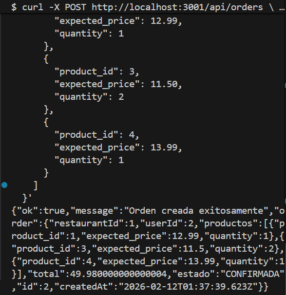

Logs en Docker-Desktop
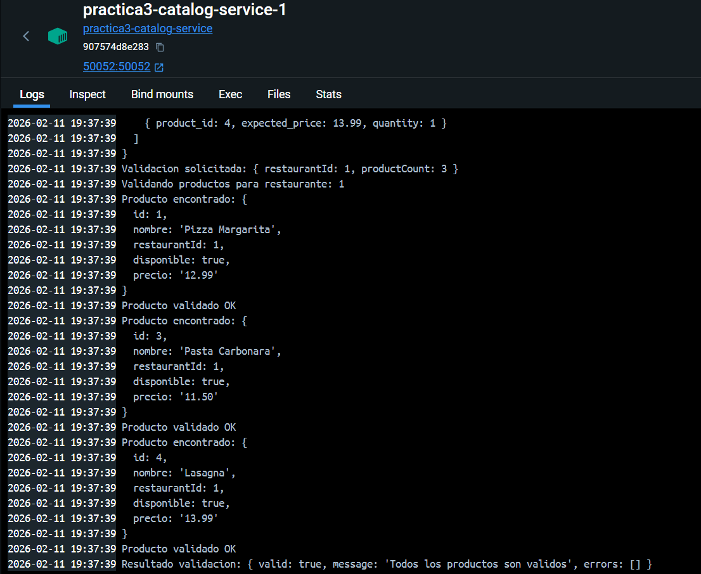

```json
{"ok":true,"message":"Orden creada exitosamente",
"order":{"restaurantId":1,"userId":2,"productos":[{"product_id":1,"expected_price":12.99,"quantity":1},{"product_id":3,"expected_price":11.5,"quantity":2},{"product_id":4,"expected_price":13.99,"quantity":1}],
"total":49.980000000000004,
"estado":"CONFIRMADA",
"id":2,
"createdAt":"2026-02-12T01:37:39.623Z"}}

```
## Prueba 3
### ORDEN A RESTAURANTE 2
Aca se realiza la orden al restaurante dos y se odenan tambien multiples productos.

Esperado: Total = 28.48, Estado = CONFIRMADA

```json
curl -X POST http://localhost:3001/api/orders \
  -H "Content-Type: application/json" \
  -d '{
    "restaurantId": 2,
    "userId": 3,
    "productos": [
      {
        "product_id": 6,
        "expected_price": 8.99,
        "quantity": 2
      },
      {
        "product_id": 8,
        "expected_price": 3.50,
        "quantity": 3
      }
    ]
  }'

```

Curl en consola
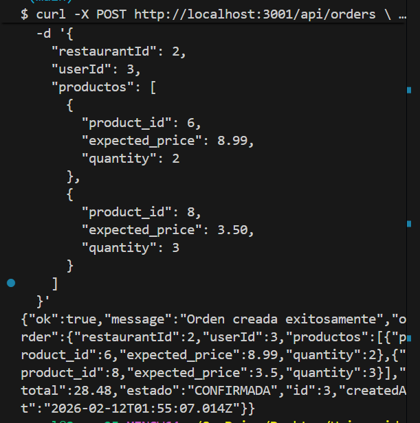

Logs en Docker-Desktop
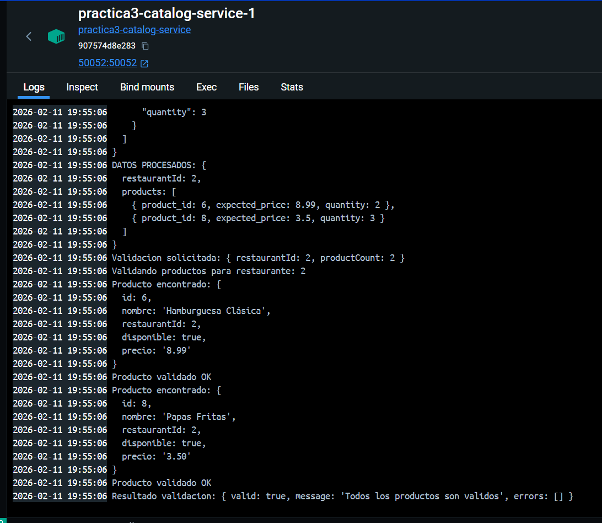

```json
{"ok":true,"message":"Orden creada exitosamente",
"order":{"restaurantId":2,"userId":3,"productos":[{"product_id":6,"expected_price":8.99,"quantity":2},{"product_id":8,"expected_price":3.5,"quantity":3}],
"total":28.48,
"estado":"CONFIRMADA",
"id":3,
"createdAt":"2026-02-12T01:55:07.014Z"}}

```
## Prueba 4
### ORDEN A RESTAURANTE 3
Aca se realiza la orden al restaurante tres y se odenan tambien multiples productos.

Esperado: Total = 44.97, Estado = CONFIRMADA

```json
curl -X POST http://localhost:3001/api/orders \
  -H "Content-Type: application/json" \
  -d '{
    "restaurantId": 3,
    "userId": 1,
    "productos": [
      {
        "product_id": 11,
        "expected_price": 15.99,
        "quantity": 2
      },
      {
        "product_id": 13,
        "expected_price": 12.99,
        "quantity": 1
      }
    ]
  }'
```
Curl en consola
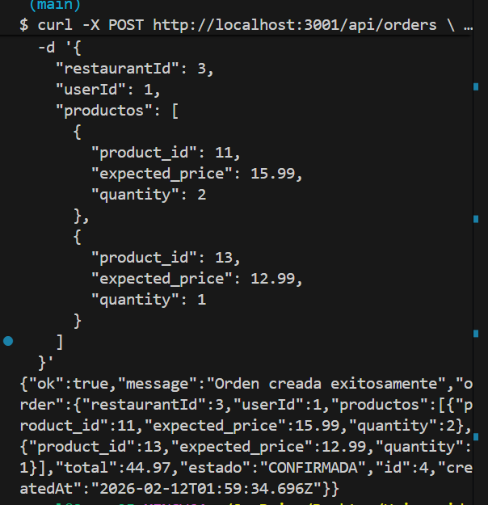

Logs en Docker-Desktop


```json
{"ok":true,"message":"Orden creada exitosamente",
"order":{"restaurantId":3,"userId":1,"productos":[{"product_id":11,"expected_price":15.99,"quantity":2},{"product_id":13,"expected_price":12.99,"quantity":1}],
"total":44.97,
"estado":"CONFIRMADA",
"id":4,
"createdAt":"2026-02-12T01:59:34.696Z"}}
```

## Prueba 5
### ORDEN GRANDE AL RESTAURANTE 2
Aca se realiza la orden al restaurante tres y se odenan tambien multiples productos.

Esperado: Total = 30.96, Estado = CONFIRMADA

```json
curl -X POST http://localhost:3001/api/orders \
  -H "Content-Type: application/json" \
  -d '{
    "restaurantId": 2,
    "userId": 4,
    "productos": [
      {
        "product_id": 6,
        "expected_price": 8.99,
        "quantity": 1
      },
      {
        "product_id": 7,
        "expected_price": 9.99,
        "quantity": 1
      },
      {
        "product_id": 9,
        "expected_price": 5.99,
        "quantity": 2
      }
    ]
  }'
```
Curl en consola
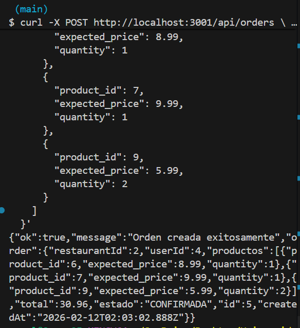

Logs en Docker-Desktop
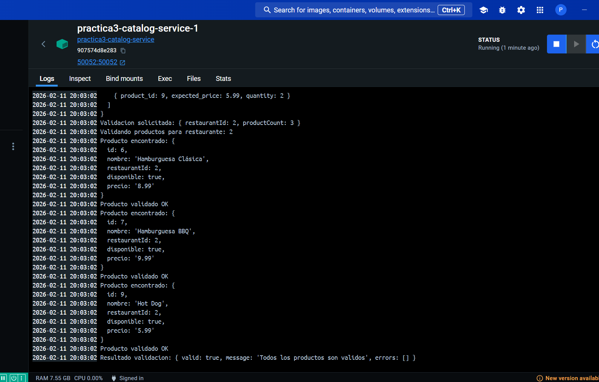

```json
{"ok":true,"message":"Orden creada exitosamente",
"order":{"restaurantId":2,"userId":4,"productos":[{"product_id":6,"expected_price":8.99,"quantity":1},{"product_id":7,"expected_price":9.99,"quantity":1},{"product_id":9,"expected_price":5.99,"quantity":2}],
"total":30.96,
"estado":"CONFIRMADA",
"id":5,
"createdAt":"2026-02-12T02:03:02.888Z"}}

```
---
# PRUEBAS FALLIDAS

## Prueba 6
### PRODUCTO NO EXISTENTE 
Aca se trata de ordenar un producto que no existe.

Esperado: Error: "Producto 999 no existe"


```json

curl -X POST http://localhost:3001/api/orders \
  -H "Content-Type: application/json" \
  -d '{
    "restaurantId": 1,
    "userId": 1,
    "productos": [
      {
        "product_id": 999,
        "expected_price": 12.99,
        "quantity": 1
      }
    ]
  }'
```
Curl en consola
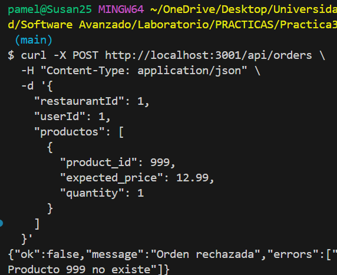

Logs en Docker-Desktop
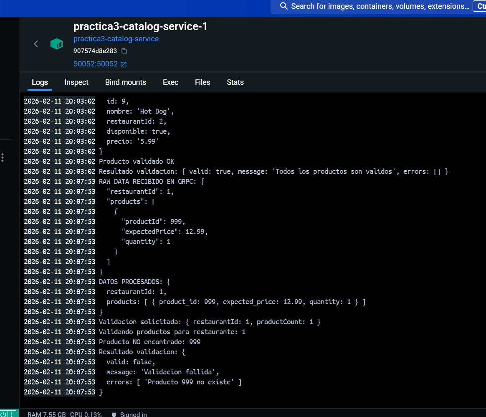

```json 
{"ok":false,
"message":"Orden rechazada",
"errors":["Producto 999 no existe"]}
```

## Prueba 7
### PRECIO INCORRECTO
Aca el precio es incorrecto en la base que se esta registrando.

Esperado: Error: "Precio incorrecto para Pizza Pepperoni. Esperado: 10, Actual: 14.99"

```json

curl -X POST http://localhost:3001/api/orders \
  -H "Content-Type: application/json" \
  -d '{
    "restaurantId": 1,
    "userId": 1,
    "productos": [
      {
        "product_id": 2,
        "expected_price": 10.00,
        "quantity": 1
      }
    ]
  }'
```
Curl en consola
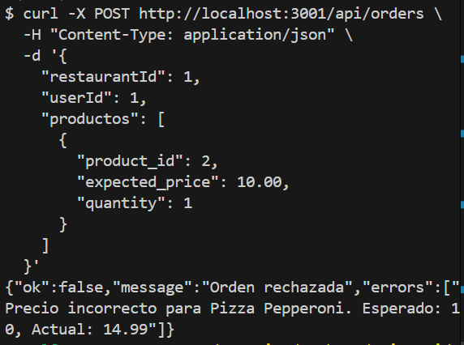

Logs en Docker-Desktop
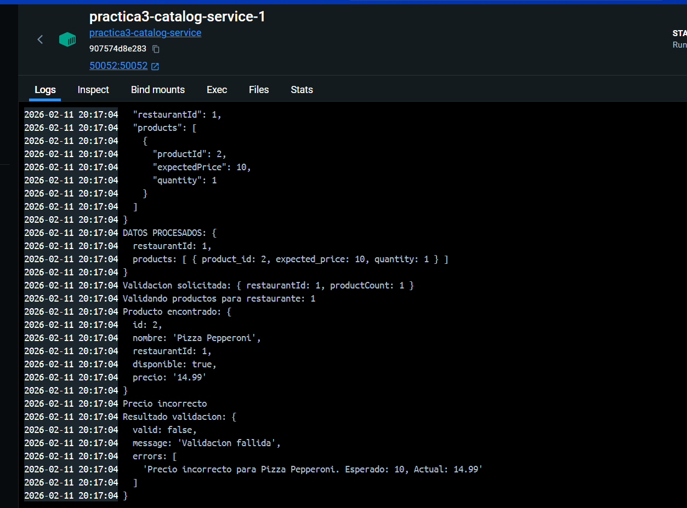

```json
{"ok":false,
"message":"Orden rechazada",
"errors":["Precio incorrecto para Pizza Pepperoni. Esperado: 10, Actual: 14.99"]}

```
## Prueba 8
### PRODUCTO NO DISPONIBLE
Aca se hace la busqueda del producto no disponible.

Esperado: Error: "Producto 5 (Tiramisu) no esta disponible"

```json
curl -X POST http://localhost:3001/api/orders \
  -H "Content-Type: application/json" \
  -d '{
    "restaurantId": 1,
    "userId": 1,
    "productos": [
      {
        "product_id": 5,
        "expected_price": 6.50,
        "quantity": 1
      }
    ]
  }'

```
Curl en consola
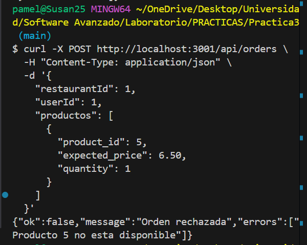

Logs en Docker-Desktop
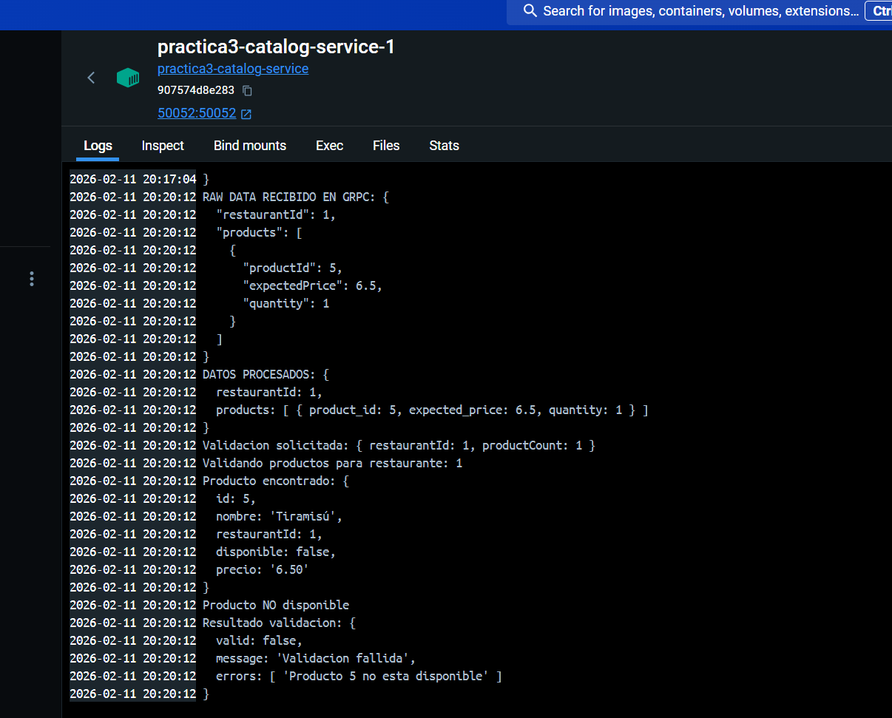

```json
{"ok":false,
"message":"Orden rechazada",
"errors":["Producto 5 no esta disponible"]}
```

## Prueba 9
### PRODUCTO DE OTRO RESTAURANTE 
Aca se trata de ordenar producto de otro restaurante, pero se hace incorrecto.

Esperado: Error: "Producto 11 no pertenece al restaurante 1"

```json
curl -X POST http://localhost:3001/api/orders \
  -H "Content-Type: application/json" \
  -d '{
    "restaurantId": 1,
    "userId": 1,
    "productos": [
      {
        "product_id": 11,
        "expected_price": 15.99,
        "quantity": 1
      }
    ]
  }'
```
Curl en consola
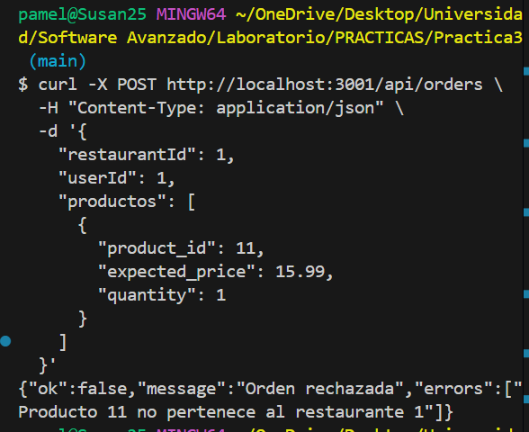

Logs en Docker-Desktop
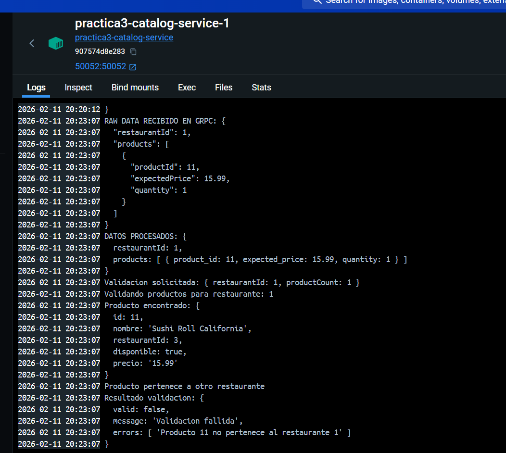

```json 
{"ok":false,
"message":"Orden rechazada",
"errors":["Producto 11 no pertenece al restaurante 1"]}
```

## Prueba 9
### ERROR MULTIPLE
Se solicito un producto que no existe y que tiene precio incorrecto 

Esperado: Errores múltiples: "Producto 888 no existe" + "Precio incorrecto para Hamburguesa Clasica. Esperado: 5, Actual: 8.99"

```json 
curl -X POST http://localhost:3001/api/orders \
  -H "Content-Type: application/json" \
  -d '{
    "restaurantId": 2,
    "userId": 1,
    "productos": [
      {
        "product_id": 888,
        "expected_price": 5.00,
        "quantity": 1
      },
      {
        "product_id": 6,
        "expected_price": 5.00,
        "quantity": 1
      }
    ]
  }'

```
Curl en consola
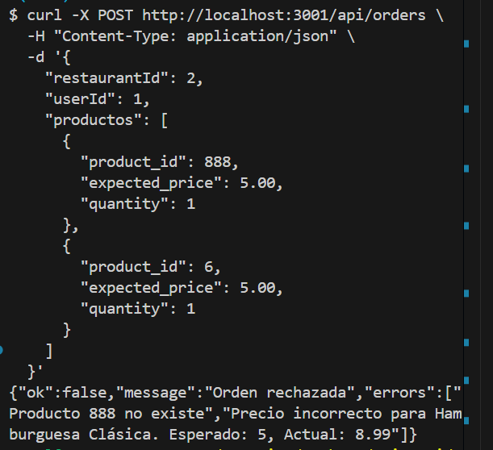

Logs en Docker-Desktop
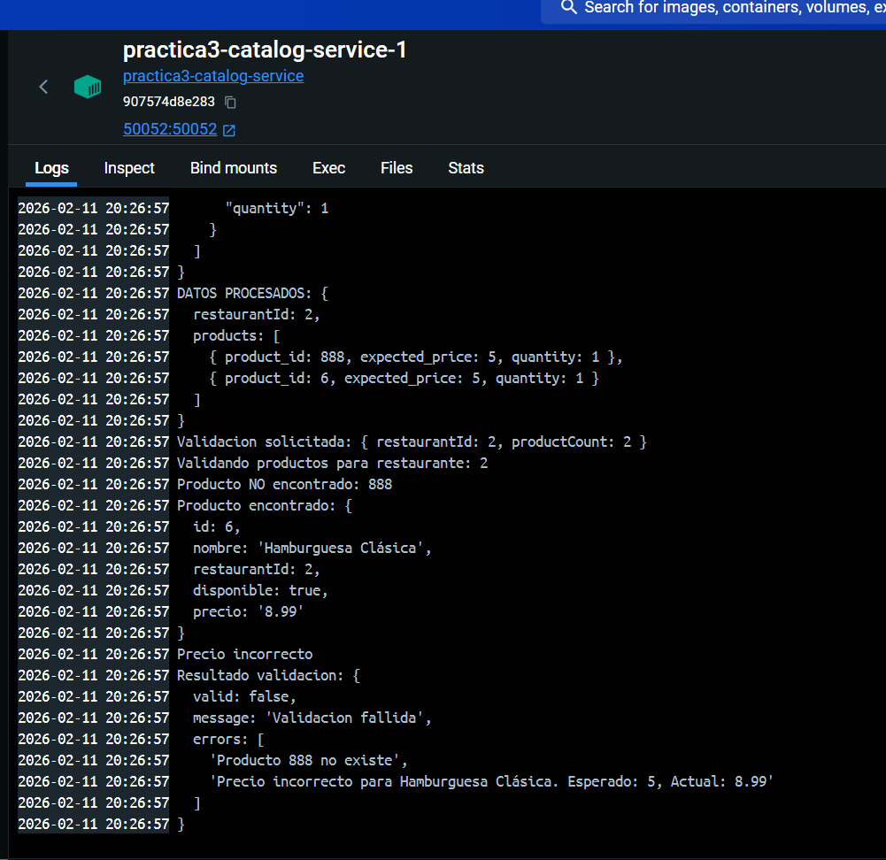

```json
{"ok":false,
"message":"Orden rechazada",
"errors":["Producto 888 no existe","Precio incorrecto para Hamburguesa Clásica. Esperado: 5, Actual: 8.99"]}
```
---
